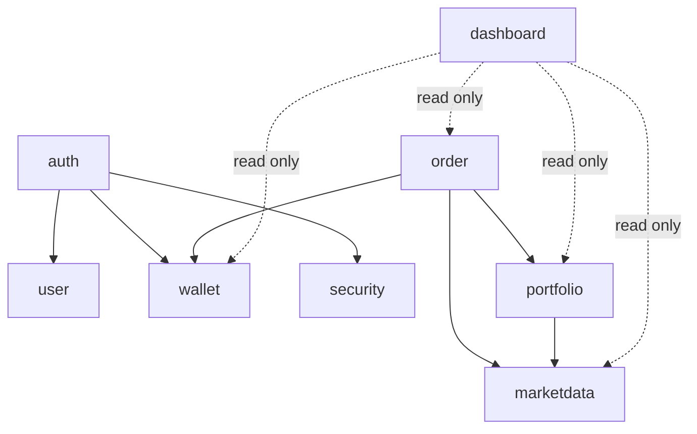
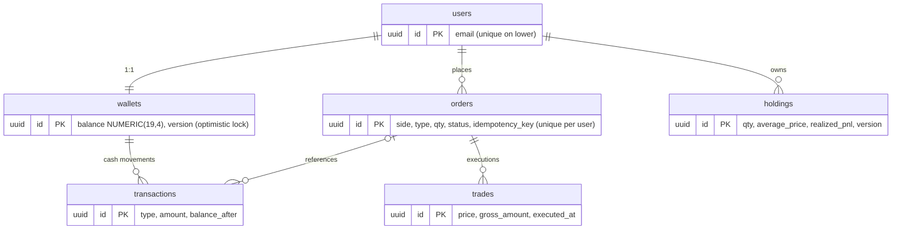

# TradeWise

A real-time paper trading platform: virtual cash, real-feeling market data, market orders,
and portfolio tracking with honest P&L accounting. Built as a portfolio project with a
depth-over-breadth philosophy — a correct, tested order engine over a dozen half-features.

**Phase 1 (this repo): backend + frontend complete.** Auth, virtual wallet, deterministic
market simulator, market buy/sell with an atomic execution engine, portfolio with realized
and unrealized P&L, a read-only dashboard — and an Angular 22 client covering all seven
screens. Advanced order types, watchlists and WebSocket streaming are Phase 2 (see
[Roadmap](#roadmap--out-of-scope-for-phase-1)).

## Architecture

A modular monolith: one deployable Spring Boot app with strict package-level domain
boundaries. Cross-module calls go through service interfaces only — never another
module's repository — and the dependency graph is one-way and acyclic, so a module
could be extracted into a service without a rewrite.



```
com.tradewise
├── auth          # registration, login, JWT issuance
├── user          # user entity, profile
├── wallet        # virtual cash balance + cash transactions
├── portfolio     # holdings, weighted-average cost, realized/unrealized P&L
├── order         # order lifecycle, synchronous market-order execution engine
├── marketdata    # provider interface, deterministic simulator, quotes/search/history/status
├── dashboard     # cross-module aggregation, strictly read-only
├── common        # audit base entity, money constants, shared enums, page envelope
├── config        # Clock, JPA auditing, DataSource + Flyway wiring
├── exception     # one error envelope, stable error codes, global handler
├── security      # filter chain, JWT verification, JSON 401/403 handlers
└── util          # (reserved for stateless helpers; intentionally empty so far)
```

## Tech stack

**Backend** — Java 21 · Spring Boot 4.1.0 (Spring Framework 7, Jackson 3) · Spring Security 7
+ JWT (jjwt 0.12.6) · Spring Data JPA / Hibernate 7 · PostgreSQL 17 · Flyway 12 · Lombok ·
JUnit 5/6 + Mockito + AssertJ + Testcontainers

**Frontend** — Angular 22 (standalone components, signals, zoneless change detection) ·
TypeScript 6 in strict mode · lightweight-charts 5 for candlesticks · hand-rolled CSS design
tokens, no UI framework

**Delivery** — Docker + Docker Compose (Postgres + backend + nginx-served frontend) ·
GitHub Actions

## Data model



Orders, trades and transactions are three different things and are modeled as three
tables: intent + lifecycle, executions only, and cash movements respectively.

## Design decisions worth reading

- **Money.** `BigDecimal` everywhere; `NUMERIC(19,4)` in Postgres; `HALF_UP` at every
  write boundary (`common/MoneyConstants`). Quote prices use scale 2 (tick size);
  ledger math widens to scale 4. No `BigDecimal` is ever constructed from a `double`.
- **Realized P&L: weighted-average cost**, not FIFO. It matches how Indian brokers
  display positions, needs no lot bookkeeping, and keeps realized P&L a single
  accumulator per position. The choice is isolated in `Holding.applyBuy/applySell`, so
  FIFO could replace it without touching callers. Tested to the rounding digit.
- **Concurrency.** `@Version` optimistic locking on wallet and holding; every execution
  is one transaction (order + cash + transaction row + position + trade commit or roll
  back together). The loser of a concurrent conflict gets `409 CONCURRENT_MODIFICATION`.
  `WalletOptimisticLockingIT` genuinely triggers the conflict with two overlapping
  transactions — the annotation is not just sitting there.
- **Idempotency.** `POST /orders` requires an `Idempotency-Key` header; `(user, key)` is
  unique in the database. A double-submitted buy returns the original order (200) and
  never produces two positions. Races land on the constraint, not on a pre-check.
- **Rejections are outcomes, not errors.** Insufficient funds/shares and market-closed
  produce a *recorded* order in status `REJECTED` with a machine-readable reason —
  order history shows every order, every status.
- **Insufficient funds policy.** Phase 1 has market orders only, so the check is
  atomic check-and-debit at execution. (Reserve-on-place vs check-on-execute becomes a
  real decision with limit orders in Phase 2.)
- **Market hours.** A market order placed while the market is closed is REJECTED, not
  queued to open. The simulator reports OPEN around the clock by default
  (`tradewise.marketdata.simulator.always-open`), so the app is demoable at 2am; set it
  to `false` to enforce real NSE hours (IST) including pre-open and a holiday sample.
- **The simulator is not a toy.** Price is a pure function of `(symbol, minute)` —
  layered sinusoids with symbol-seeded phases plus bounded hash noise around a fixed
  reference price. Deterministic by construction: quotes, charts and order-engine tests
  agree on the same price for the same instant, and history's last candle closes at
  exactly the current quote. Swappable behind `MarketDataProvider`.
- **Auth.** BCrypt cost 12; passwords capped at 72 chars (BCrypt truncates beyond 72
  bytes — we reject instead). Unknown-email and wrong-password return byte-identical
  401s, and login runs BCrypt against a dummy hash for unknown emails so timing is no
  oracle either. JWT secret comes from the environment with **no default** — the app
  refuses to start without one. Identity is read from the verified token only.
- **Schema.** Flyway owns it (`ddl-auto: validate`). UUID keys, real FK constraints,
  indexes on lookup columns, audit columns everywhere. Soft delete on `users` only —
  orders/trades/transactions are append-only financial records; a delete flag there
  would be a column no code path sets.

## API

Full OpenAPI 3 spec: [`backend/docs/openapi.yaml`](backend/docs/openapi.yaml)
(paste into https://editor.swagger.io to browse).

| Area | Endpoints |
|---|---|
| Auth | `POST /api/v1/auth/register`, `POST /api/v1/auth/login` |
| User & wallet | `GET /api/v1/users/me`, `GET /api/v1/wallets/me`, `GET /api/v1/transactions` |
| Market | `GET /api/v1/market/search?query=`, `GET /api/v1/market/quotes/{symbol}`, `GET /api/v1/market/history/{symbol}?range=`, `GET /api/v1/market/status` |
| Trading | `POST /api/v1/orders` (Idempotency-Key required), `GET /api/v1/orders`, `GET /api/v1/orders/{id}`, `GET /api/v1/trades` |
| Portfolio | `GET /api/v1/portfolio`, `GET /api/v1/dashboard` |

Every non-2xx response uses one envelope:

```json
{ "timestamp": "...", "status": 409, "errorCode": "EMAIL_ALREADY_REGISTERED",
  "message": "This email is already registered", "path": "/api/v1/auth/register",
  "fieldErrors": null }
```

## Frontend

Seven screens, all lazily routed: **Login/Register · Dashboard · Trade · Stock detail ·
Portfolio · Orders (with a Trades tab) · Account**.

Decisions worth knowing:

- **Signals, zoneless.** State lives in signals inside services and components;
  `provideZonelessChangeDetection()` means no zone.js patching in the bundle.
- **Two interceptors, no leakage.** `authInterceptor` attaches the bearer token;
  `errorInterceptor` converts every failure into one typed `AppError` and handles the
  single global case — a 401 clears the session and redirects to login. Components never
  see an `HttpErrorResponse`.
- **Polling, not WebSocket** (a documented Phase 1 decision). `pollWhileVisible()` refreshes
  every 12s, pauses on hidden tabs, and refetches on refocus. Screens are shaped around
  this function so a WebSocket source can replace it without touching them.
- **Rejections are outcomes, not errors.** An `INSUFFICIENT_FUNDS` order returns 201 with
  status `REJECTED`; the UI shows it as an in-place outcome banner, never a crash toast.
- **Idempotency.** Every order submission mints a UUID `Idempotency-Key`, so a double-click
  cannot open two positions.
- **Money is display-only on the client.** The server is the sole authority for money
  arithmetic; the one client-side figure (the order ticket's cost preview) is explicitly
  labelled an estimate. All formatting goes through a single `money` pipe.
- **No colour-only meaning.** Gains and losses carry an explicit sign as well as a colour.
- **Loading / empty / error on every data view**, via a shared `StateBlock`; a background
  poll never blanks a screen the user is reading.

Bundle: ~295 kB initial (~81 kB transferred). The charting library is isolated in the
lazily-loaded stock-detail chunk, so it costs nothing until a chart is opened.

## Run it

```bash
export JWT_SECRET="change-me-to-a-random-string-of-32+chars"
docker compose up --build
```

Then open **http://localhost:4200** — register an account and you're trading with
₹10,00,000 of virtual cash. The API is on http://localhost:8080.

### Running the frontend on its own

```bash
cd frontend
npm ci
npm start          # http://localhost:4200, proxies /api to localhost:8080
npm run build      # production build into dist/
```

Requires **Node ≥ 22.22.3** (or 24.15+/26+) — Angular 22's floor, declared in
`package.json` engines. The Docker build pins Node 24 so the container never depends on
your local version.

Then:

```bash
# register (also logs you in)
curl -s -X POST localhost:8080/api/v1/auth/register -H 'Content-Type: application/json' \
  -d '{"email":"me@example.com","password":"passw0rd123","fullName":"Me"}'

# buy 10 RELIANCE (use the accessToken from above)
curl -s -X POST localhost:8080/api/v1/orders \
  -H "Authorization: Bearer $TOKEN" -H 'Content-Type: application/json' \
  -H 'Idempotency-Key: my-first-buy' \
  -d '{"symbol":"RELIANCE","side":"BUY","type":"MARKET","quantity":10}'

# watch it in the portfolio
curl -s localhost:8080/api/v1/portfolio -H "Authorization: Bearer $TOKEN"
```

### Tests

```bash
cd backend
mvn test                 # unit tests (no Docker needed)
mvn test -Pintegration   # + Testcontainers integration tests against real Postgres (needs Docker)
```

CI (GitHub Actions) runs the full suite including integration tests on every push and PR.

## Known limitations — honest edition

- **Market data is simulated.** Prices are a deterministic function around fixed
  reference anchors, not a live feed. The `MarketDataProvider` interface is the seam
  where a real provider plugs in; nothing downstream would change.
- **The frontend has no automated tests yet.** It was verified by a scripted browser
  click-through (register → buy → reject → sell → portfolio → chart → orders → account,
  plus guard and offline-error paths) and builds clean under strict mode, but there are no
  committed unit or e2e specs. That's the first thing I'd add.
- **No WebSocket, so the UI polls** every 12 seconds. Prices tick visibly but not
  instantly, and two tabs can briefly disagree.
- **springdoc/Swagger UI is not wired in.** This project targets Spring Boot 4.1, and
  the build environment used for Phase 1 had no Boot-4-compatible springdoc artifact
  available. The OpenAPI spec is maintained by hand at `backend/docs/openapi.yaml` and
  springdoc is planned once wired dependencies are available.
- **No WebSocket streaming.** Real-time push (prices, portfolio, order status) is
  Phase 2; a frontend today would poll.
- **Single currency, whole shares, no fees/taxes.** Virtual cash has no FX; quantities
  are integers; brokerage/STT are not modeled, so P&L is gross.
- **Simulator day-high/low are sampled** (15-minute grid), not true extrema of the
  continuous price function.
- **JWT is access-token-only** (60 min): no refresh tokens, no revocation list;
  expiry means re-login. Deferred deliberately.
- **The holiday calendar is a 4-date sample**, not the full NSE calendar.
- **MapStruct is not used yet** — mapping is hand-written `from(...)` factories, which
  at current DTO count is less machinery than MapStruct would add. Revisit as DTOs grow.

## Roadmap — out of scope for Phase 1

Limit and stop-loss orders + the matching engine (sweep vs tick evaluation, gap
handling, double-execution prevention) · order cancellation and expiry · WebSocket
streaming to replace polling · watchlists and price alerts · frontend unit/e2e test suite ·
refresh tokens and email verification · Redis quote caching (only when measurement
demands it).
